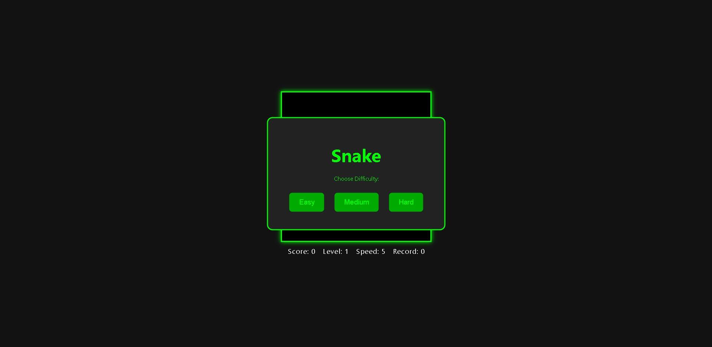

<p align="center"></p>

## Snake Game

A simple and classic Snake game built using HTML, CSS, and JavaScript.


---

## Features

- 🎮 Move the snake using arrow keys or WSDA.
- 🍎 Grow the snake by eating food.
- 🏆 Keep track of the score.
- 💥 Game over when the snake hits the wall or itself.
- 📱 Responsive design for different screen sizes.

---

## Installation

1. Clone the repository

```bash
git clone https://github.com/Sakludo/SnakeGame.git
```

2. Open index.html in your browser

3. Start playing

---

## Screenshots

<p align="center"></p>
<p align="center"></p>

---

Thank you for your interest in my project.
